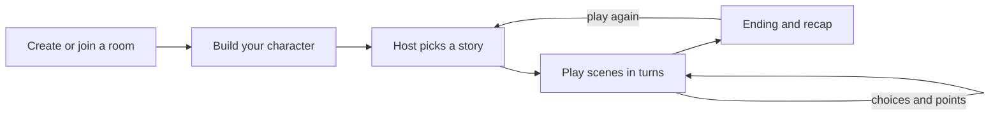
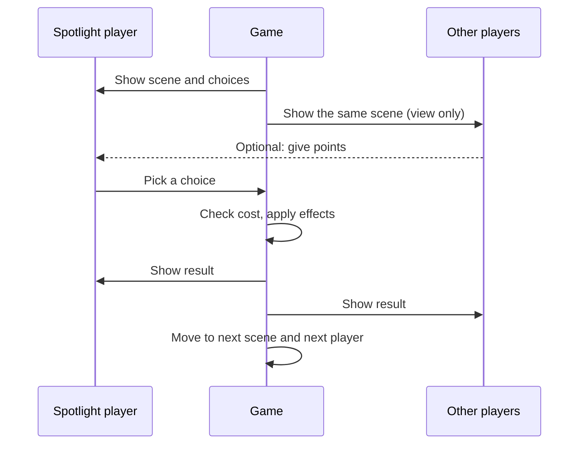
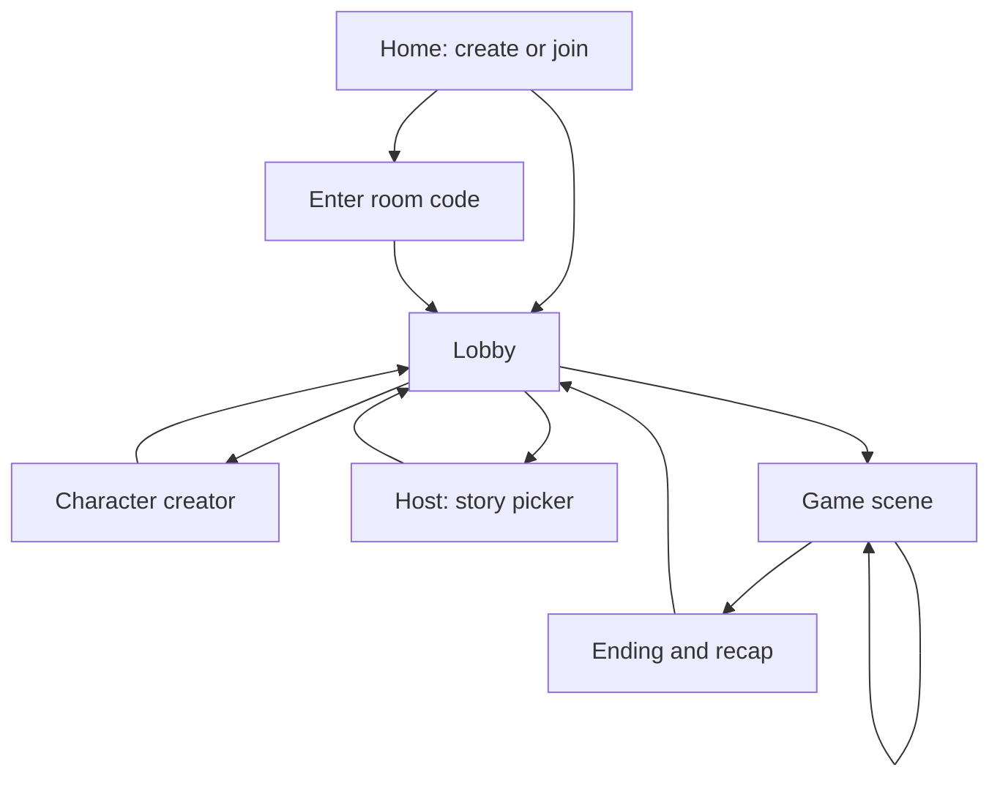

# Pilot Season: Game Design Document

*Working draft, v0.1. A multiplayer, turn-based story game with pixel-art characters, played in the browser with friends.*

---

## 1. The pitch

A small group of friends joins a private room, each builds a pixel-art character, and the host picks a story to play through together. The story unfolds in turns: each scene puts one player (or the whole group) in front of a choice, and those choices steer the story toward different endings. Most choices are free, but at a few key moments the best option costs points, so players have to plan ahead, and sometimes help each other, to avoid the bad outcome.

The feel we're aiming for is "a TV episode you and your friends star in": short sessions (20 to 40 minutes), lots of laughs, and a shareable ending screen with everyone's characters on it.

## 2. Core loop

A session always follows the same shape, which keeps it easy to learn and easy to build.



The loop inside a story is where the game lives: a scene is shown, a player makes a choice, the result changes the story and possibly everyone's points, and the turn passes on.

## 3. Rooms and the lobby

### Creating a room

The first screen offers two actions: **Create a room** and **Join a room**. Creating a room makes that player the **host** and generates a short, easy-to-say room code (for example `GOOSE-42` or four letters like `KBLT`). The host sets the maximum number of players when creating the room.

| Setting | Suggested values | Notes |
|---|---|---|
| Max players | 2 to 6 (default 4) | Stories should be written to work across this range. More than 6 makes waiting between turns too long. |
| Room privacy | Code only | Public room lists can come later, if ever. |
| Turn timer | Off, 60s, 90s | Keeps things moving; on timeout the game picks the "safe" option. |

### Joining

A player enters the code and a display name. If the room is full, or the game has already started, they see a clear message explaining why they can't join ("This room is full, 4 of 4 players" or "This game already started"). Rejoining after a disconnect should put the player back in their own seat with their character intact, which means the game identifies players by a saved player ID, not just by their connection.

### The lobby screen

The lobby shows every player's character standing in a row, a ready indicator above each one, the room code with a copy button, and, for the host only, the story picker and the **Start** button. The host can start once every player is marked ready. The host can also remove a player, and if the host leaves, host powers pass to the player who joined next.

## 4. Character creator

### Art format

Characters are small pixel-art sprites built from stacked layers. A good starting size is **32×32 pixels** per sprite (enough detail for faces and hair, still quick to draw), displayed scaled up 4× to 6× with crisp pixels (`image-rendering: pixelated` in CSS). If your example character uses a different size, the whole system should follow that size instead; the layer approach stays the same.

### Layers

Each character is drawn by stacking these layers in order, back to front. Every layer is a separate transparent PNG of the same size, so any combination lines up automatically.

| Order | Layer | Example options |
|---|---|---|
| 1 | Hair (back) | Only used by long styles |
| 2 | Body | Body type A, body type B |
| 3 | Skin tone | 6 to 8 tones (color swap, see below) |
| 4 | Outfit bottom | Jeans, skirt, shorts, space suit legs |
| 5 | Outfit top | T-shirt, hoodie, apron, blazer |
| 6 | Eyes | Round, sleepy, sparkly, angry |
| 7 | Eyebrows | Straight, raised, thick |
| 8 | Mouth | Smile, grin, flat, open |
| 9 | Hair (front) | 8 to 12 styles |
| 10 | Accessory | Glasses, cap, headphones, none |

You mentioned a choice like male or female. A flexible way to handle that is to offer it as a **body type** preset that sets sensible defaults, while still letting any hair, outfit and face option be picked with any body. Players get quick starting points and full freedom, and you draw fewer assets overall.

### Colors without extra art

Instead of drawing every hair style in every color, draw each part once in a small set of "key" grayscale shades, then swap those shades for the chosen palette when rendering (a technique called palette swapping). One hair drawing with 4 shades becomes 10 hair colors for free. The same trick handles skin tones, eye colors and outfit colors.

### What gets saved and sent

A character is just a small list of choices, which makes it cheap to save and to send to the other players:

```json
{
  "name": "Sam",
  "body": 1,
  "skin": 3,
  "hair": 7,
  "hairColor": 2,
  "eyes": 0,
  "eyeColor": 4,
  "brows": 1,
  "mouth": 2,
  "top": 5,
  "topColor": 1,
  "bottom": 0,
  "accessory": null
}
```

Every player's browser draws the sprite locally from this data, so no images are ever uploaded.

### Creator screen

The layout has the character preview large in the center, category tabs on one side (Body, Face, Hair, Outfit, Extras), and a grid of options for the chosen tab. Arrow buttons next to the preview cycle through options quickly, and a **Randomize** button helps players who want to jump straight in. Small animations, such as a blink or an idle bounce, make the preview feel alive and cost only a second frame per face layer.

## 5. Story selection

Only the host picks the story, from a list of cards showing the title, a one-line hook, length, and recommended player count. Some story ideas to start from:

| Story | Hook | Tone |
|---|---|---|
| The Pilot | Your group has seven days to make a TV show. | Comedy |
| The Sleepover | Something is living in the attic, and it wants snacks. | Spooky, silly |
| Mall Heist | Steal back the trophy the rival school "borrowed." | Caper |
| Stranded | Your cruise ship's captain has vanished. So has the buffet. | Adventure |
| Station 9 | The space station's AI has fallen in love with the vending machine. | Sci-fi comedy |

It's best to start with **one** story that is fully written and polished, then add more once the system works. Each story is a data file (see section 8), so adding a story never requires changing the game code.

## 6. Turns

### Turn order

The game runs through **scenes**. Each scene has a **spotlight player**, the one who makes the choice, and the spotlight rotates around the room so everyone gets an equal share. Players who aren't in the spotlight still see the scene and the options, so they stay involved and can offer help (see the point-sharing rule below).

Some scenes can be marked as **group scenes**, where everyone votes and the majority wins (the spotlight player breaks ties). Mixing a group scene in every 3 to 4 scenes keeps the waiting players engaged.

### Anatomy of a scene

A scene shows the setting background, the characters present, a few lines of story text, and 2 to 4 choices. After a choice, a short result text plays and any point changes appear on screen, then the turn passes on.



## 7. Points and gated choices

This is the mechanic you described: most choices are free, but at a few important moments some options require points, and the free option is usually the worse one.

### What the points are

The simplest version is a single currency per player, called **Stars** here (the name can match the theme). Players earn Stars from good choices, from story events, and from small bonuses like being picked as the funniest line in a group vote.

A slightly deeper version gives each player three stats instead, such as **Charm**, **Wits** and **Guts**, with gated choices requiring a specific stat. That adds strategy and gives characters more personality, but it's more to balance. A good plan is to launch with Stars and consider stats later.

### How gated choices work

A gated choice shows its cost on the button (for example "Talk the guard down, 3 ⭐"). If the spotlight player can afford it, they can pick it and the Stars are spent. If they can't, the button is shown but locked, so everyone can see what they're missing.

Two design decisions to make:

**Spend or threshold?** Spending means the Stars are used up, so players must decide when a moment is worth it. A threshold means you only need to *have* that many, which is friendlier but less strategic. Spending is recommended for the key moments.

**Can teammates help?** Letting other players give some of their Stars to the spotlight player (during the scene, before the choice is made) turns a solo problem into a group decision and creates great "who's going to save us?" moments. This fits a friends game well.

### When to use gates

Gates should appear only at a few **crisis scenes**, around 2 to 4 in a 20-scene story, so they feel special. A crisis scene should be visually marked (a red border or a warning sound) so players know the stakes are higher.

### What happens on a bad choice

Failing a crisis should create a funny setback rather than end the game. Useful options include sending the story down a worse branch, taking Stars away from everyone, or giving the group a lasting **mishap** (for example "The goose now hates you: the next crisis costs 1 more Star"). Endings can then vary based on how many mishaps the group collected.

### Example crisis scene

> **The Pilot, scene 12: the network boss walks in early.** The set is on fire and the goose is loose.
>
> 1. "Pretend the fire is part of the show." **Free.** Leads to *Mishap: the boss thinks you're unhinged.*
> 2. "Distract him with the catchphrase." **Costs 2 ⭐.** Safe, the story continues normally.
> 3. "Get the whole cast to perform a musical number." **Costs 5 ⭐.** Best outcome, and everyone earns 1 ⭐ back.

## 8. Story data

Every story is a JSON file describing a graph of scenes. The game reads the file and plays it, so writers can add stories without touching code.

```json
{
  "id": "the-pilot",
  "title": "The Pilot",
  "players": { "min": 2, "max": 6 },
  "startingStars": 3,
  "start": "s1",
  "scenes": {
    "s12": {
      "type": "crisis",
      "mode": "spotlight",
      "background": "studio_fire",
      "text": "The network boss walks in early. The set is on fire and the goose is loose.",
      "choices": [
        { "label": "Pretend the fire is part of the show", "cost": 0,
          "effects": { "addMishap": "boss_suspicious" }, "next": "s13b" },
        { "label": "Distract him with the catchphrase", "cost": 2, "next": "s13" },
        { "label": "Start a musical number", "cost": 5,
          "effects": { "starsAll": 1 }, "next": "s13" }
      ]
    }
  },
  "endings": [
    { "id": "hit", "requires": { "maxMishaps": 0 }, "title": "Renewed for nine seasons" },
    { "id": "cult", "requires": { "minMishaps": 2 }, "title": "Cancelled, now a cult classic" }
  ]
}
```

Scene text can include placeholders like `{spotlight}` or `{randomPlayer}` so players' names show up in the story, which makes each run feel personal.

## 9. Screens



The **ending screen** should show all the characters together, the ending title, a short recap of the biggest choices, and awards such as "Most Stars given away" or "Caused the most mishaps." A **Download image** button for this screen makes the game easy to share.

## 10. Technical plan

### The key constraint

Vercel is great for hosting the website, but its serverless functions aren't built to keep live WebSocket connections open, which is what a real-time multiplayer room needs. The usual solution is to host the site on Vercel and use a separate real-time service for the rooms.

| Option | Why consider it |
|---|---|
| Supabase Realtime | Free tier, has "presence" (who's in the room) and broadcast channels, plus a database if you want saved characters later. |
| PartyKit (Cloudflare) | Designed for exactly this kind of room-based multiplayer, with a small server per room. |
| Liveblocks or Ably | Hosted real-time services with good free tiers and simple JavaScript libraries. |
| Firebase Realtime Database | Very common, with many tutorials. |

Check each service's current free-tier limits before choosing, since they change.

### Who is in charge of the game state

To keep it simple, the **host's browser acts as the referee**: it holds the story state, checks point costs, and broadcasts updates to everyone else. Other players only send requests ("I pick choice 2", "I give 1 Star to Sam"). This is easy to build and fine for a game among friends. The weakness is that if the host disconnects, the game has to hand the state to another player, so the full game state should be broadcast regularly so anyone can take over.

A server-run referee (for example with PartyKit) is more robust and harder to cheat, and is a good upgrade once the game works.

### Suggested stack

Next.js or Vite with React for the interface, a canvas element to draw pixel sprites, the chosen real-time service for rooms, and JSON files for stories. Deploying the frontend works the same as any Vercel project: push to GitHub and import the repo.

### Core state

```ts
type Room = {
  code: string;
  hostId: string;
  maxPlayers: number;
  status: "lobby" | "playing" | "ended";
  players: Player[];
  storyId: string | null;
  game: GameState | null;
};

type Player = {
  id: string;          // saved in the browser so rejoining works
  name: string;
  character: Character;
  ready: boolean;
  stars: number;
  connected: boolean;
};

type GameState = {
  sceneId: string;
  spotlightIndex: number;
  mishaps: string[];
  votes: Record<string, number>;   // for group scenes
  history: { sceneId: string; playerId: string; choice: number }[];
};
```

## 11. Build plan

It's much easier to build this in stages, each one playable on its own.

| Stage | Goal | Done when |
|---|---|---|
| 1 | Single-player prototype | One short story plays in one browser with Stars and one crisis scene. |
| 2 | Character creator | A working creator with a few options per layer, saved in the browser. |
| 3 | Rooms | Create and join by code, lobby shows everyone's characters live. |
| 4 | Multiplayer turns | Spotlight rotation, synced scenes, point giving, group votes. |
| 5 | Polish | Ending screen, sounds, animations, reconnecting, turn timer. |
| 6 | More content | Second and third stories, more character parts. |

Stage 1 matters most: if the story and the point decisions are fun on one screen, everything after that is about sharing it.

## 12. Open questions

These are the decisions still to make, roughly in order of importance:

1. **Your character reference:** the exact sprite size and style will shape the whole art pipeline.
2. **Which story comes first,** and roughly how long it should be.
3. **Points design:** single Stars currency or three stats; spend or threshold; whether teammates can give points.
4. **Losing:** can a story end badly, or does every run reach some kind of ending?
5. **Group scenes:** how often, and whether votes are secret or visible.
6. **Theme:** does every story share one world and one art style (a TV network, for example), or is each story its own world?
